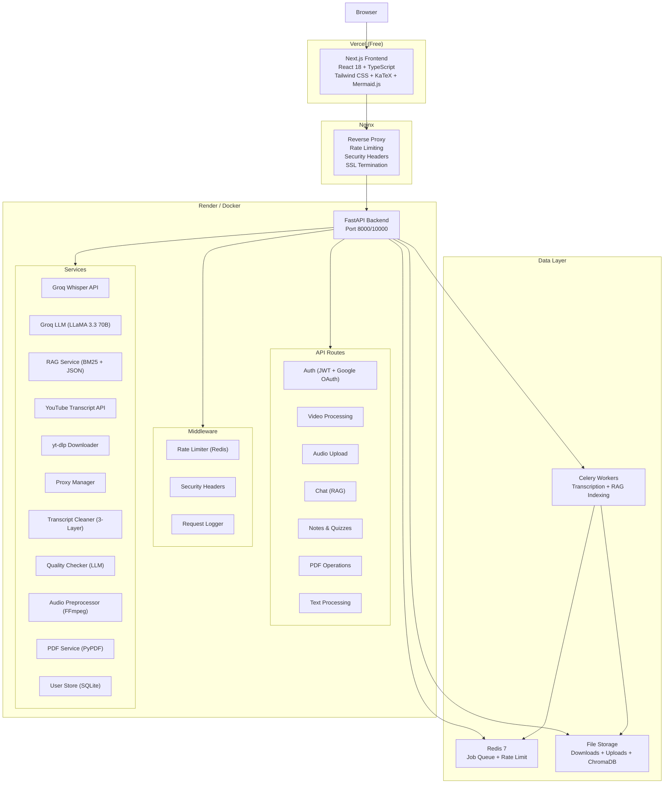
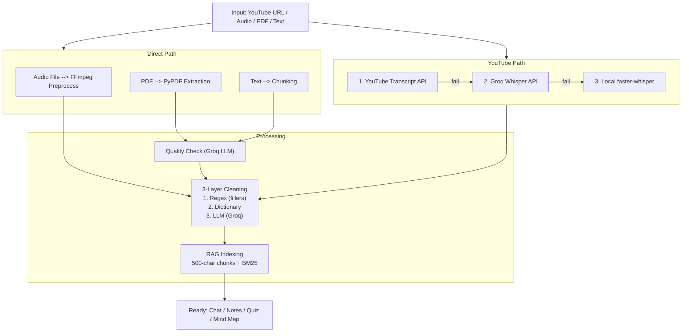
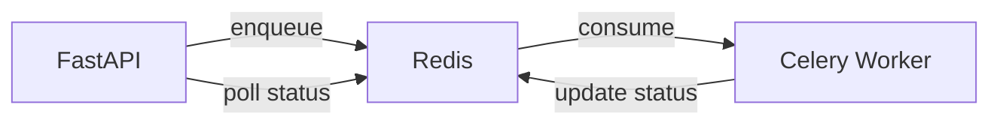
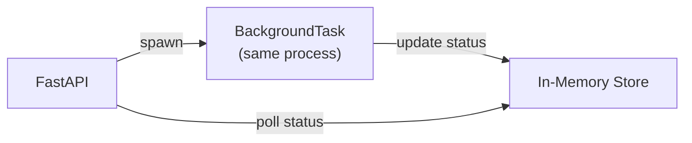

<p align="center">
  
  
  
  
  
  
  
  
</p>

<h1 align="center">VidSage — AI-Powered Video Learning Platform</h1>

<p align="center">
  <strong>Full-stack application that transforms any YouTube video, audio file, PDF, or raw text into an interactive study session — with AI-powered transcription, smart chat, structured notes, mind maps, and quizzes.</strong>
</p>

---

## Table of Contents

- [Overview](#overview)
- [Key Features](#key-features)
- [Architecture](#architecture)
- [Tech Stack](#tech-stack)
- [AI & ML Pipeline](#ai--ml-pipeline)
- [API Reference](#api-reference)
- [Security](#security)
- [Getting Started (Local)](#getting-started-local)
- [Production Deployment](#production-deployment)
- [Project Structure](#project-structure)
- [Job Processing Pipeline](#job-processing-pipeline)
- [Monitoring & Observability](#monitoring--observability)

---

## Overview

VidSage is a production-grade, full-stack AI application designed for students, researchers, and lifelong learners. It accepts multiple input sources — YouTube URLs, audio files (MP3/WAV/M4A/AAC/OGG/FLAC up to 500 MB), PDFs, and raw text — and produces:

- **Accurate transcripts** via a multi-source pipeline (YouTube Captions API → Groq Whisper API → local faster-whisper fallback)
- **AI Chat** with timestamped context (BM25 retrieval + Groq LLM)
- **Structured summaries** with video type detection, key points, and terminology
- **Masterclass notes** in Markdown, LaTeX, or Jupyter Notebook format with PDF compilation
- **Interactive mind maps** rendered via Mermaid.js
- **Suggested questions** auto-generated from video content

The system is built for reliability and scale — with a multi-service Docker architecture, Celery background workers, Redis-backed job queues, Nginx reverse proxy with rate limiting, and a comprehensive CI/CD pipeline.

---

## Key Features

| Feature | Description |
|---|---|
| **Multi-Source Transcription** | YouTube captions API → Groq Whisper large-v3 → local faster-whisper fallback chain |
| **3-Layer Transcript Cleaning** | Regex filler removal → custom domain dictionary → Groq LLM context-aware correction |
| **Transcript Quality Validation** | LLM-based topic coherence checker rejects hallucinated auto-captions before they reach the user |
| **RAG-Powered AI Chat** | BM25 retrieval over timestamped segments + Groq LLaMA-3.3-70B for grounded, source-cited answers |
| **Streaming Responses** | Server-Sent Events (SSE) streaming for real-time chat token delivery |
| **PDF & Text Processing** | Upload PDFs or paste raw text; content is chunked, indexed, and chat-ready |
| **Masterclass Notes** | AI-generated structured notes in Markdown, LaTeX, or Jupyter Notebook (.ipynb) |
| **LaTeX → PDF Compilation** | Server-side XeLaTeX/pdfLaTeX compilation with tcolorbox formatting |
| **Mind Map Generation** | AI-generated Mermaid.js flowcharts for visual topic overview |
| **YouTube Audio Download** | Extract and serve MP3 audio from any YouTube video |
| **Google OAuth + JWT Auth** | Secure authentication with Google SSO, PBKDF2 password hashing, access/refresh token rotation |
| **Rate Limiting** | Multi-layer: Nginx (IP-level) + FastAPI middleware (endpoint-level) with Redis-backed sliding windows |
| **Proxy Rotation** | Configurable proxy pool with round-robin rotation, cooldown tracking, and automatic revival for YouTube access |
| **Background Job Processing** | Celery workers with Redis broker for heavy transcription jobs; falls back to FastAPI BackgroundTasks for single-process mode |
| **Real-Time Progress** | Pollable job status with percentage progress, elapsed time, and estimated time remaining |
| **Responsive Frontend** | Mobile-friendly Next.js dashboard with Tailwind CSS, KaTeX math rendering, and Mermaid diagram visualization |

---

## Architecture



<details>
<summary>Text version (if Mermaid doesn't render)</summary>

```
                          Nginx (Reverse Proxy)
                     Rate Limiting | Security Headers | SSL
                              |
              +---------------+---------------+
              |                               |
     Frontend (Next.js)              Backend (FastAPI)
         Port 3000                   Port 8000/10000
      React 18                  +---- API Routes ----+
      TypeScript                | Auth (JWT+OAuth)   |
      Tailwind CSS              | Video Processing   |
      KaTeX + Mermaid.js        | Audio Upload       |
                                 | Chat (RAG)         |
                                 | Notes & Quizzes    |
                                 | PDF / Text         |
                                 +--------------------+
                                 +---- Middleware ----+
                                 | Rate Limiter       |
                                 | Security Headers   |
                                 | Request Logger     |
                                 +--------------------+
                                 +---- Services ------+
                                 | Groq Whisper API   |
                                 | Groq LLM (70B)     |
                                 | RAG (BM25 + JSON)  |
                                 | YouTube API        |
                                 | yt-dlp             |
                                 | Proxy Manager      |
                                 | Transcript Cleaner |
                                 | Quality Checker    |
                                 | FFmpeg Preproc.    |
                                 +--------------------+
                                          |
                     +--------------------+--------------------+
                     |                    |                    |
                  Redis 7          Celery Workers       File Storage
               Job Queue          Transcription       Downloads/Uploads
              Rate Limit           RAG Indexing          ChromaDB
```
</details>

---

## Tech Stack

### Backend

| Layer | Technology | Purpose |
|---|---|---|
| **API Framework** | FastAPI 0.109+ (Python 3.11) | Async REST API with automatic OpenAPI docs |
| **ASGI Server** | Uvicorn + Gunicorn | Production-grade server with UvicornWorker class |
| **Task Queue** | Celery 5.3 + Redis 7 | Background transcription and RAG indexing jobs |
| **AI — Transcription** | Groq Whisper large-v3 API | Cloud-based speech-to-text (fastest Whisper API) |
| **AI — Fallback Transcription** | faster-whisper (CTranslate2) | Local Whisper fallback for offline/self-hosted use |
| **AI — LLM** | Groq LLaMA-3.3-70B-Versatile | Chat, summaries, notes, mind maps, quality checks |
| **AI — LLM Cleaning** | Groq LLaMA-3.1-8B-Instant | Fast transcript correction (3rd cleaning layer) |
| **AI — Retrieval** | Custom BM25 + JSON-based RAG | Lightweight retrieval over timestamped segments |
| **Audio Processing** | FFmpeg | Mono conversion, 16kHz resampling, loudness normalization, optional FFT denoising |
| **YouTube** | yt-dlp + youtube-transcript-api | Video/audio download and caption extraction |
| **PDF Processing** | PyPDF 4.1+ | Text extraction from uploaded PDFs |
| **LaTeX Compilation** | XeLaTeX / pdfLaTeX | Server-side PDF generation from AI-generated LaTeX |
| **Authentication** | python-jose (JWT) + Google OAuth 2.0 | Secure auth with access/refresh token rotation |
| **Password Security** | PBKDF2-SHA256 (300K iterations) | Constant-time comparison, salted hashes |
| **Database** | SQLite (OAuth users) | Lightweight user store for Google SSO |
| **Rate Limiting** | Redis-backed sliding window counters | Distributed rate limiting across workers |
| **Security** | Custom middleware suite | Security headers, request logging, CORS |

### Frontend

| Layer | Technology | Purpose |
|---|---|---|
| **Framework** | Next.js 14 (React 18) | Server-side rendering, routing |
| **Language** | TypeScript 5.3 | Type-safe development |
| **Styling** | Tailwind CSS 3.4 | Utility-first responsive design |
| **Markdown Rendering** | react-markdown + remark-gfm + rehype | Rich content display with GitHub-flavored markdown |
| **Math Rendering** | KaTeX (remark-math + rehype-katex) | LaTeX math in notes and chat |
| **Diagram Rendering** | Mermaid.js 11 | Interactive mind maps |
| **PDF Generation** | html2pdf.js + jsPDF | Client-side PDF export |
| **Icons** | Lucide React | Consistent icon set |
| **Deployment** | Vercel | Edge-optimized frontend hosting |

### Infrastructure

| Component | Technology | Purpose |
|---|---|---|
| **Containerization** | Docker + Docker Compose | Multi-service orchestration (5 services) |
| **Reverse Proxy** | Nginx (Alpine) | Load balancing, rate limiting, security headers, SSL |
| **CI/CD** | GitHub Actions | Automated lint, test, Docker build, security scan |
| **Monitoring** | Prometheus + Grafana | Metrics collection and dashboards |
| **Cloud Deployment** | Render (backend) + Vercel (frontend) | Free-tier production hosting |

---

## AI & ML Pipeline

### Transcription Pipeline (Multi-Source Fallback)



### Transcript Cleaning — 3-Layer Pipeline

| Layer | Method | What it fixes |
|---|---|---|
| **Layer 1: Regex** | Pattern matching | Filler words (um, uh, like, you know), repeated words, spacing, punctuation, capitalization |
| **Layer 2: Dictionary** | Custom word map | Domain-specific terms, proper nouns (e.g., "one new man" → "Von Neumann"), project names |
| **Layer 3: LLM** | Groq LLaMA-3.1-8B-Instant | Context-aware correction of proper nouns, technical terms, grammar; chunked processing with concurrency control (2 concurrent, 3-retry on 429) |

### RAG Chat — Retrieval + Generation

1. **Indexing**: Transcript is split into ~500-character chunks, each tagged with start/end timestamps
2. **Retrieval**: User question → BM25 word-overlap scoring → top-5 most relevant chunks
3. **Context building**: Each chunk is prefixed with `[Time: M:SS–M:SS]` for source citation
4. **Generation**: Groq LLaMA-3.3-70B-Versatile generates a grounded answer using only retrieved context
5. **Streaming**: Response streams token-by-token via SSE for real-time display

---

## API Reference

All API routes are prefixed with `/api/` and documented via Swagger at `/docs`.

### Authentication

| Method | Endpoint | Description |
|---|---|---|
| `POST` | `/api/auth/login` | Username/password login → JWT access + refresh tokens (HttpOnly cookies) |
| `POST` | `/api/auth/refresh` | Refresh expired access token using refresh token |
| `POST` | `/api/auth/logout` | Clear auth cookies |
| `GET` | `/api/auth/me` | Get current user profile |
| `GET` | `/api/auth/google` | Initiate Google OAuth 2.0 flow |
| `GET` | `/api/auth/google/callback` | Google OAuth callback handler |

### Video Processing

| Method | Endpoint | Description |
|---|---|---|
| `POST` | `/api/video/download` | Process YouTube URL — auto-routes through captions → validation → Whisper pipeline |
| `GET` | `/api/video/audio/{video_id}` | Download extracted MP3 audio for a YouTube video |

### Audio Upload

| Method | Endpoint | Description |
|---|---|---|
| `POST` | `/api/audio/upload` | Upload audio file (up to 500 MB) → returns `job_id` for polling |
| `GET` | `/api/audio/status/{job_id}` | Poll job status with progress %, elapsed time, estimated remaining |
| `GET` | `/api/audio/result/{job_id}` | Get completed transcript result |
| `GET` | `/api/audio/health` | Service health check |

### AI Chat (RAG)

| Method | Endpoint | Description |
|---|---|---|
| `POST` | `/api/chat/ask` | Ask a question about a processed video (full response) |
| `POST` | `/api/chat/ask/stream` | Ask a question (streaming SSE response) |
| `GET` | `/api/chat/suggest/{video_id}` | Get 5 AI-generated suggested questions |
| `GET` | `/api/chat/summary/{video_id}` | Generate structured video summary |
| `GET` | `/api/chat/mindmap/{video_id}` | Generate Mermaid.js mind map |

### Notes & Quizzes

| Method | Endpoint | Description |
|---|---|---|
| `POST` | `/api/notes/masterclass` | Generate masterclass notes (Markdown, LaTeX, or Jupyter Notebook) |
| `GET` | `/api/notes/download/pdf/{video_id}` | Generate and download compiled LaTeX PDF notes |
| `POST` | `/api/notes/compile` | Compile arbitrary LaTeX to PDF |

### Other

| Method | Endpoint | Description |
|---|---|---|
| `POST` | `/api/text/process` | Process raw text input with validation + cleaning + RAG indexing |
| `POST` | `/api/pdf/upload` | Upload PDF → extract text → index for chat |
| `POST` | `/api/clean/` | Run 3-layer cleaning pipeline on any text |
| `POST` | `/transcribe/` | Direct transcription endpoint (local file path) |
| `GET` | `/health` | Basic health check |
| `GET` | `/health/detailed` | Detailed health check (Redis, services) |
| `GET` | `/about` | API info and capabilities |

---

## Security

VidSage implements security at multiple layers:

### Application Layer
- **JWT Authentication**: HS256 signed tokens with issuer, audience, JTI, and configurable expiry
- **Token Rotation**: Separate access (15 min) and refresh (7 days) tokens with HttpOnly, Secure, SameSite cookies
- **Password Hashing**: PBKDF2-SHA256 with 300,000 iterations and random salt
- **Login Rate Limiting**: Per-IP + per-username tracking with configurable attempt limits
- **Constant-Time Comparison**: `hmac.compare_digest` for all secret comparisons (timing attack prevention)

### Middleware Layer
- **Rate Limiting**: Redis-backed sliding window counters per endpoint (auth: 5/min, uploads: 10/5min, chat: 30/min, video: 15/10min)
- **In-Memory Fallback**: Automatically degrades to per-process rate limiting if Redis is unavailable
- **Security Headers**: X-Frame-Options, X-Content-Type-Options, X-XSS-Protection, Referrer-Policy, Permissions-Policy
- **Request Logging**: Structured request/response logging with request IDs

### Infrastructure Layer (Nginx)
- **IP-Level Rate Limiting**: Shared memory zones for auth (5/min), uploads (6/min), API (30/min), global (120/min)
- **Connection Limits**: Max 50 concurrent connections per IP
- **Attack Path Blocking**: Blocks wp-admin, .env, .git, config files
- **Hidden Server Version**: Server tokens disabled
- **Upload Size Limit**: 500 MB max with 300s timeouts

### Google OAuth 2.0
- **State Parameter**: Cryptographic random state with HttpOnly cookie validation (CSRF protection)
- **PKCE-Ready**: Authorization code flow with client secret

---

## Getting Started (Local)

### Prerequisites

- Python 3.11+
- Node.js 20+
- FFmpeg (for audio processing)
- Docker (for Redis)
- A [Groq API key](https://console.groq.com/) (free tier available)

### 1. Clone the Repository

```bash
git clone https://github.com/sumitiitj493-boop/vidsage-ai.git
cd vidsage-ai
```

### 2. Backend Setup

```bash
cd backend

# Create virtual environment
python -m venv .venv
source .venv/bin/activate    # Linux/macOS
# .venv\Scripts\activate     # Windows

# Install dependencies
pip install -r requirements.txt

# Configure environment
cp .env.example .env
# Edit .env and add your GROQ_API_KEY and other settings
```

### 3. Start Redis

```bash
docker run -d --name vidsage-redis -p 6379:6379 redis:7-alpine
```

### 4. Start Celery Worker (Optional — for background processing)

```bash
cd backend
celery -A app.celery_app worker -l info -P solo
```

> **Note:** Without Celery, the app uses FastAPI's `BackgroundTasks` for transcription jobs — fully functional for single-process development.

### 5. Start the API Server

```bash
cd backend
uvicorn app.main:app --reload --reload-exclude "chroma_db/*"
```

API available at `http://localhost:8000/docs` (Swagger UI).

### 6. Frontend Setup

```bash
cd frontend

# Install dependencies
npm install

# Configure environment
cp .env.example .env.local
# Edit .env.local and set NEXT_PUBLIC_API_BASE_URL=http://localhost:8000

# Start development server
npm run dev
```

Frontend available at `http://localhost:3000`.

---

## Production Deployment

### Docker Compose (Full Stack — Recommended)

```bash
# Configure environment
cp backend/.env.example backend/.env
# Edit backend/.env with production values

# Generate secure secrets
python generate_secrets.py

# Start all services
docker compose up -d

# View logs
docker compose logs -f

# Health check
curl http://localhost/health
```

Services started: **Nginx → Frontend → Backend → Celery Worker → Redis** (5 containers).

### Cloud Deployment (Free Tier)

| Service | Platform | Notes |
|---|---|---|
| **Frontend** | Vercel | Zero-config deployment via `vercel.json` |
| **Backend** | Render | Docker-based via `Dockerfile.render` + `render.yaml` blueprint |
| **Redis** | Upstash | Free serverless Redis with TLS (`rediss://`) |

See [FREE-DEPLOY-STEP-BY-STEP.md](FREE-DEPLOY-STEP-BY-STEP.md) for detailed instructions.

---

## Project Structure

```
vidsage-ai/
├── backend/
│   ├── app/
│   │   ├── main.py                    # FastAPI app with lifespan, middleware, CORS
│   │   ├── config.py                  # Centralized settings from .env
│   │   ├── security.py                # JWT, PBKDF2, auth rate limiter
│   │   ├── celery_app.py              # Celery config with Redis broker + SSL
│   │   ├── api/
│   │   │   ├── deps.py                # Dependency injection (auth, transcription singleton)
│   │   │   └── routes/
│   │   │       ├── auth.py            # Login, refresh, logout, Google OAuth
│   │   │       ├── video.py           # YouTube processing with multi-strategy routing
│   │   │       ├── upload.py          # Audio upload with chunked writing
│   │   │       ├── chat.py            # RAG chat (full + streaming)
│   │   │       ├── notes.py           # Notes generation + LaTeX PDF compilation
│   │   │       ├── pdf.py             # PDF upload + text extraction
│   │   │       ├── text_input.py      # Raw text processing
│   │   │       ├── clean.py           # Standalone cleaning endpoint
│   │   │       └── transcription.py   # Direct transcription endpoint
│   │   ├── middleware/
│   │   │   ├── rate_limiter.py        # Redis/in-memory sliding window rate limiter
│   │   │   ├── security.py            # Security headers middleware
│   │   │   └── request_logger.py      # Request/response logging middleware
│   │   ├── models/
│   │   │   ├── auth_models.py         # Pydantic models for auth requests/responses
│   │   │   ├── video_models.py        # Video request models
│   │   │   ├── text_models.py         # Text input models
│   │   │   └── transcription_models.py# Transcription request/response models
│   │   ├── services/
│   │   │   ├── rag_service.py         # BM25 RAG + Groq LLM (chat, summary, notes, mindmap)
│   │   │   ├── transcription_service.py# Groq Whisper API + local faster-whisper fallback
│   │   │   ├── youtube_transcript_service.py # YouTube captions API wrapper
│   │   │   ├── youtube_service.py     # Production-resilient multi-strategy transcript fetcher
│   │   │   ├── video_downloader.py    # yt-dlp audio/video downloader with cookie support
│   │   │   ├── transcript_cleaner.py  # 3-layer cleaning pipeline (regex + dict + LLM)
│   │   │   ├── transcript_quality_checker.py # LLM-based topic validation
│   │   │   ├── proxy_manager.py       # Proxy pool with rotation, cooldown, health tracking
│   │   │   ├── pdf_service.py         # PDF text extraction + LaTeX compilation
│   │   │   ├── audio_uploader.py      # Chunked file upload with validation (500 MB limit)
│   │   │   ├── job_manager.py         # Redis/in-memory job state tracking
│   │   │   ├── google_oauth.py        # Google OAuth 2.0 flow (auth URL, code exchange, profile)
│   │   │   └── user_store.py          # SQLite-based OAuth user store
│   │   ├── tasks/
│   │   │   └── transcription_tasks.py  # Celery tasks + BackgroundTasks pipeline
│   │   └── utils/
│   │       └── audio_preprocess.py    # FFmpeg audio preprocessing (mono, 16kHz, normalize)
│   ├── tests/
│   ├── requirements.txt
│   ├── Dockerfile
│   ├── Dockerfile.render
│   ├── gunicorn_conf.py
│   └── render-start.sh
├── frontend/
│   ├── app/                           # Next.js App Router pages
│   │   ├── page.tsx                   # Landing page
│   │   ├── dashboard/page.tsx         # Main dashboard
│   │   ├── login/page.tsx             # Login with Google OAuth
│   │   ├── layout.tsx                 # Root layout
│   │   └── globals.css                # Global styles
│   ├── components/
│   │   ├── Dashboard.tsx              # Main dashboard orchestrator
│   │   └── dashboard/
│   │       ├── Header.tsx             # Input bar (YouTube URL, PDF, audio, text)
│   │       ├── Sidebar.tsx            # Video info, controls, audio player
│   │       ├── ChatWindow.tsx         # AI chat with streaming + fullscreen tutor mode
│   │       ├── TranscriptView.tsx     # Timestamped transcript display
│   │       ├── SummaryView.tsx        # Structured summary with download
│   │       ├── NotesView.tsx          # Masterclass notes (MD/LaTeX/PDF/Notebook)
│   │       ├── MindMapView.tsx        # Interactive Mermaid.js mind map
│   │       ├── ProgressView.tsx       # Real-time processing progress bar
│   │       ├── ProcessingLoader.tsx   # Processing animation
│   │       ├── LandingView.tsx        # Landing page hero
│   │       └── HistoryModal.tsx       # Session history browser
│   ├── hooks/
│   │   ├── useChat.ts                 # Chat state management hook
│   │   ├── useNotes.ts                # Notes generation hook
│   │   └── useVideoProcessor.ts       # Video processing orchestration hook
│   ├── lib/
│   │   ├── auth.ts                    # Auth utilities (authFetch, token management)
│   │   ├── types/dashboard.ts         # TypeScript type definitions
│   │   └── utils/
│   │       ├── formatters.ts          # Text formatting utilities
│   │       └── markdown.ts            # Markdown/math normalization
│   ├── package.json
│   ├── Dockerfile
│   ├── vercel.json
│   └── next.config.js
├── nginx/
│   └── nginx.conf                     # Production reverse proxy config
├── monitoring/
│   ├── docker-compose.monitoring.yml  # Prometheus + Grafana stack
│   └── prometheus.yml                 # Metrics collection config
├── scripts/
│   ├── backup.sh                      # Data backup script
│   └── restore.sh                     # Data restore script
├── .github/workflows/
│   └── deploy.yml                     # CI/CD: lint → test → build → security scan
├── docker-compose.yml                 # Full-stack multi-service orchestration
├── render.yaml                        # Render deployment blueprint
└── Makefile                           # Convenient commands (up, down, logs, health)
```

---

## Job Processing Pipeline

VidSage supports two modes of background processing:

### Mode 1: Celery + Redis (Production)



- Jobs are shared between API server and workers via Redis
- Supports horizontal scaling (multiple workers)
- SSL-enabled for cloud Redis (Upstash)

### Mode 2: FastAPI BackgroundTasks (Development / Single Process)



- Zero external dependencies (no Redis needed)
- Jobs stored in-process memory
- Ideal for local development and free-tier deployment

### Job Status Lifecycle

| Stage | Description |
|---|---|
| `uploading` | File is being written to disk (chunked) |
| `queued` | Job is waiting in queue for a worker |
| `downloading` | YouTube audio is being downloaded via yt-dlp |
| `preprocessing` | Audio is being converted to mono 16kHz WAV via FFmpeg |
| `transcribing` | Groq Whisper API or local Whisper is running (with real-time progress %) |
| `cleaning` | 3-layer transcript cleaning pipeline is running |
| `indexing` | Cleaned segments are being inserted into the RAG index |
| `completed` | Job finished successfully — transcript, chat, notes all ready |
| `failed` | Error occurred — check `error` field for details |

---

## Monitoring & Observability

### Built-in Endpoints

- `GET /health` — Lightweight liveness check
- `GET /health/detailed` — Redis connectivity + service status

### Prometheus + Grafana

Included monitoring stack via Docker Compose:

```bash
docker compose -f monitoring/docker-compose.monitoring.yml up -d
```

Exports metrics from FastAPI, Redis, Nginx, and Celery for visualization in Grafana dashboards.

### Structured Logging

All backend services use structured logging with consistent format:

```
2025-05-22 16:14:34 INFO app.services.rag_service Indexing video abc123 for RAG...
```

---

## Environment Variables

Key environment variables (see `backend/.env.example` for full list):

| Variable | Required | Description |
|---|---|---|
| `GROQ_API_KEY` | **Yes** | Groq API key for Whisper transcription + LLM |
| `ENVIRONMENT` | No | `development` or `production` (default: `development`) |
| `REDIS_URL` | No | Redis URL for Celery + rate limiting (default: `redis://localhost:6379/0`) |
| `FRONTEND_URL` | No | Frontend URL for CORS (default: `http://localhost:3000`) |
| `AUTH_ENABLED` | No | Enable authentication (default: `true`) |
| `AUTH_USERNAME` | No | Admin username (default: `admin`) |
| `AUTH_PASSWORD_HASH` | **Prod** | PBKDF2 hash (generate with `python generate_secrets.py`) |
| `AUTH_SECRET_KEY` | **Prod** | JWT signing key (≥32 characters, generate with `python generate_secrets.py`) |
| `GOOGLE_CLIENT_ID` | No | Google OAuth client ID |
| `GOOGLE_CLIENT_SECRET` | No | Google OAuth client secret |
| `PROXY_LIST` | No | Comma-separated proxy URLs for YouTube rotation |
| `YT_COOKIE_FILE` | No | Path to cookies.txt for authenticated YouTube access |
| `WHISPER_MODEL_SIZE` | No | Local Whisper model size (default: `base`) |

---

## License

This project is available for educational and portfolio purposes.

---

<p align="center">
  Built with ❤️ by <a href="https://github.com/sumitiitj493-boop">Sumit Kumar</a>
</p>
